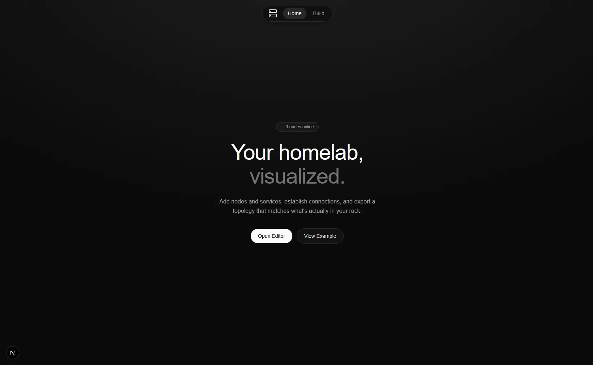

# Lab View

Lab view is an Open Source homelab visualizing tool, with import, export and share.

**URL:** [lab.sander.tf](https://lab.sander.tf/)

## Tech Stack

- Next.JS 16
- TailwindCSS
- Framer Motion

## Features
-  Drag-and-drop canvas
-  Shareable links
-  Import / Export
-  Custom node icons
-  Rich link previewsr
-  Local persistence
-  Responsive design

## Getting started

```bash
# clone the repo
git clone https://github.com/sanderhd/labview.git
cd labview

# install dependencies
npm install
 
# run the dev server
npm run dev
```
 
Open [http://localhost:3000](http://localhost:3000) to view it in your browser.
